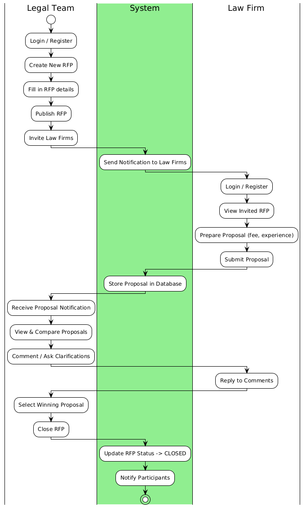
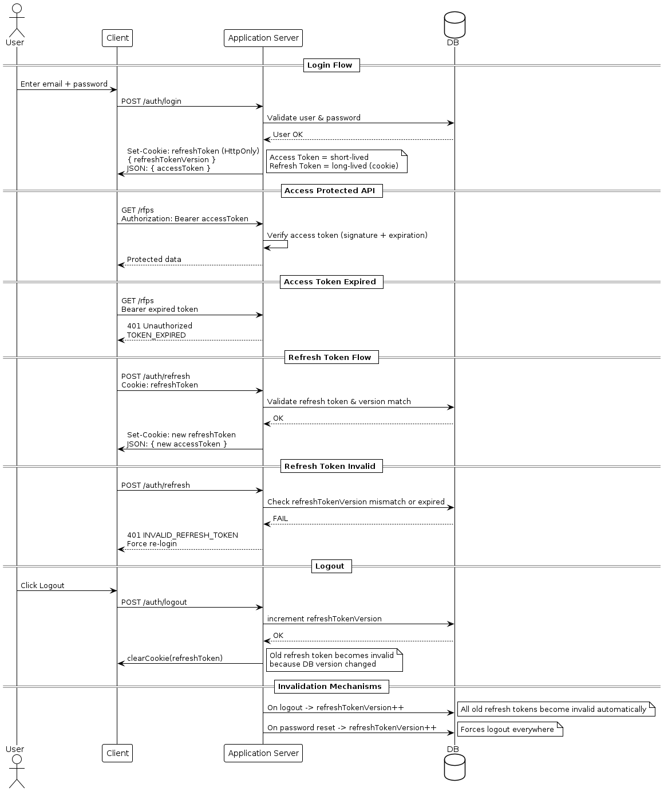

# ⚖️ PERSUIT Clone Backend

> A self-built backend project inspired by **PERSUIT**, a LegalTech platform helping corporate legal teams manage **RFPs (Request for Proposals)** and then select Proposals from law firms.  

> This repository demonstrates a full **Node.js + Express + MongoDB** backend designed to handle RFP creation, proposal submissions, comments - just like in real PERSUIT workflows.

---

## 🧭 Overview

This project aims to replicate the **core business flow of PERSUIT**, connecting **Corporate Legal Teams** and **Law Firms** within an **Organisation**.  
It focuses on how RFPs are created, proposals are submitted, and how each user interacts within the system.

### 🎯 Business Understanding

In a real corporate legal department:

1. A **Legal Team** (inside an Organisation) posts a **Request for Proposal (RFP)** when they need external law firms for a matter (e.g., litigation, M&A).
2. **Law Firms** receive invitations to view that RFP and submit **Proposals**.
3. Both parties may exchange **Comments** or clarifications.
4. The **Legal Team** compares proposals (cost, experience, etc.) and selects one.
5. The **RFP** is closed and archived.

---

## ⚙️ Tech Stack

| Layer | Technology | Purpose |
|-------|-------------|----------|
| Backend | **Node.js + Express + TypeScript** | Server framework |
| Database | **MongoDB + Mongoose** | Data persistence |
| Security | **Helmet, CORS, JWT** | API protection |
| Logging | **Morgan** | Request logs |
| Audit | **Database table** | Store audit logs for operations |
| Testing | **Jest (planned)** | Unit and API tests |
| Dev Tools | **Nodemon, ts-node-dev** | Hot reload for development |

---

## 🧩 API implementation guide

All APIs follow:

- Express routes under src/routes

- Controllers under src/controllers

- TypeScript runtime validation with zod under src/validators

- MongoDB + Mongoose models

- JWT auth (access + refresh tokens)

- Audit logging for RFP & Proposal operations
---

## 🧩 System Architecture

### 🔄 High-Level User Flow

### 🔄 Authentication Flow

